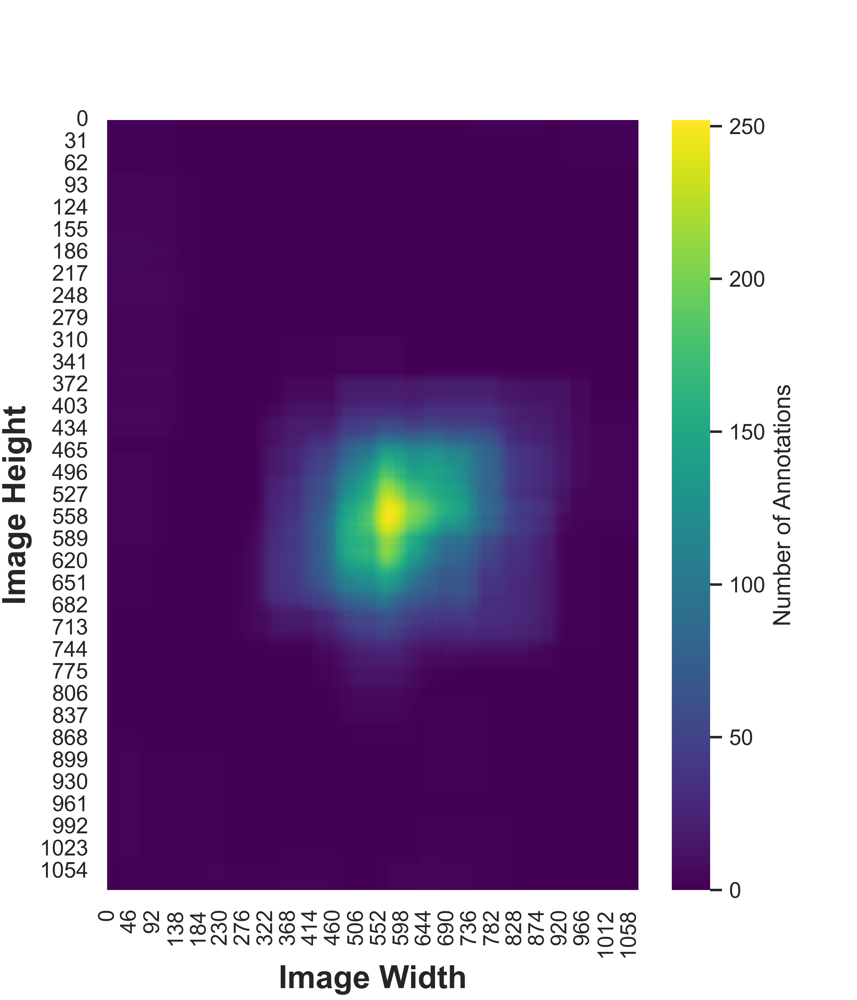
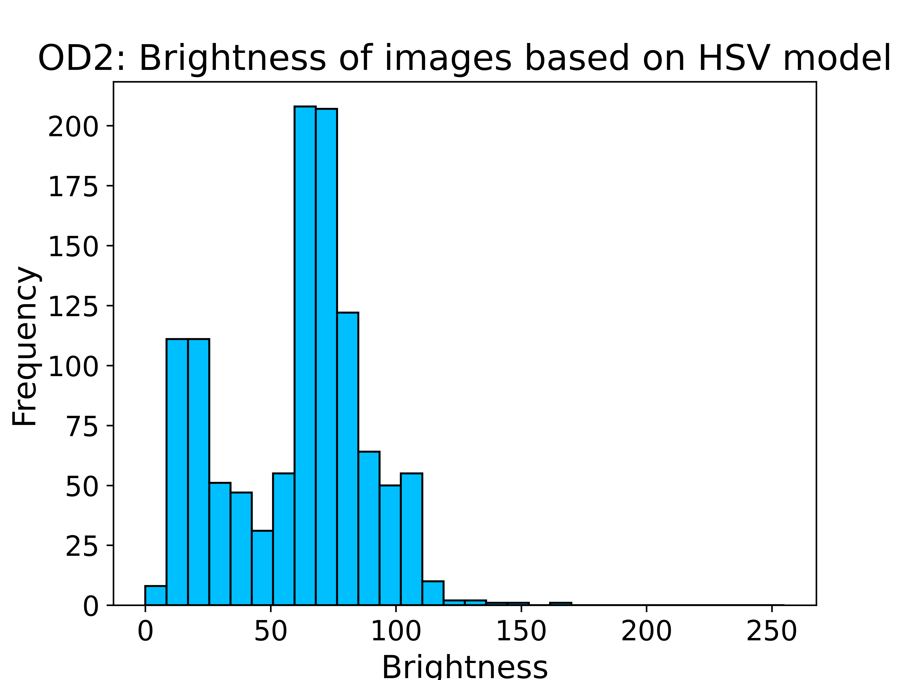

# Black Ice Detection Dataset

## Introduction

### Overview

Road safety during winter months remains a critical concern due to the elusive nature of black ice, a thin layer of ice that forms on road surfaces, making it challenging for drivers to identify and navigate safely. In an effort to address this issue, our research team at Cheongshim International Academy (CSIA) has conducted extensive studies on real-time black ice detection utilizing YOLOX, a state-of-the-art object detection algorithm, deployed on drones. As a significant contribution to the research community, we are pleased to share our meticulously curated image dataset, which encapsulates diverse scenarios and conditions representative of real-world black ice occurrences.

---

### Significances of the Dataset

The significance of this dataset lies in its potential to advance the development of effective black ice detection algorithms. By sharing our dataset with the research community, we aim to facilitate the creation of more accurate and reliable models for real-time detection of black ice using drone technology. The dataset includes annotations in COCO format, providing detailed information about the location and characteristics of black ice instances in each image.

---

## Categorization

In our pursuit of advancing the field of computer vision and contributing to ongoing research endeavors, we proudly introduce three distinct image datasets meticulously curated by our research team. These datasets, categorized as "White," "Black," and "Outdoors (OD)," cater to unique scenarios and are designed to fuel the development of specialized models addressing specific challenges in visual recognition.

---

## Dataset Statistics

### Train, Valid, Test Data Distribution
| Dataset | Train | Valid | Test |
|---------|-------|-------|------|
| White   | 413   | 0     | 0    |
| Black   | 814   | 0     | 0    |
| OD      | 1137  | 325   | 162  |

---

## Dataset in Numbers
| Metric                              | White   | Black   | OD      |
|-------------------------------------|---------|---------|---------|
| Number of Annotations               | 437     | 2819    | 2417    |
| Average Annotations per Image       | 1.1     | 3.5     | 1.5     |
| Average Proportion of Instance Pixel Area | 3.16%   | 12.37%  | 12.34%  |
| Average Image Brightness            | 149.358 | 123.028 | 56.575  |

---

### White Dataset

#### Composition

This dataset comprises 413 images, each meticulously annotated with an average of 1.1 annotations per image, depicting the unique optical characteristics of black ice.

#### Properties

The average proportion of instance pixel area is 3.16%, emphasizing the subtlety of the black ice formations. The average image brightness is measured at 149.358.

#### Capture Environment

The images were taken in controlled indoor laboratory conditions, ensuring consistency and repeatability.

#### Creation Method

The dataset was generated by cooling asphalt samples in a freezer to temperatures ranging from -4°C to -20°C. Subsequently, 4°C water was sprayed onto the sample surfaces, creating black ice. The dataset captures the optical properties of black ice, showcasing its interaction with light.

#### Significance

Valuable for highlighting the optical characteristics of black ice, enhancing model accuracy in well-lit scenarios.

##### Annotations per Image

##### Annotation Locations in Heatmaps

##### Distribution of Pixel Proportion and Brightness
 

---

### Black Dataset

#### Composition

This dataset comprises 814 images, with a detailed annotation structure averaging 3.5 annotations per image, showcasing the challenges of recognition in low-light conditions.

#### Properties

The average proportion of instance pixel area is notably higher at 12.37%, reflecting the complex and varied formations of black ice. The average image brightness is measured at 123.028.

#### Capture Environment

Similar to the White Dataset, images were captured in a controlled indoor laboratory environment. Asphalt pelt was placed under the black iced asphalt pieces to replicate realistic scenarios.

#### Creation Method

The dataset creation involved the same process of cooling asphalt samples, followed by spraying water to create black ice. To simulate real-world conditions, asphalt pelt was used as a background, and various shapes of black ice were randomly placed in each image.

#### Significance

Realistic emulation of black ice using backgrounds made up of asphalt pelts, providing essential dark images for robust model training.

##### Annotations per Image

##### Annotation Locations in Heatmaps

##### Distribution of Pixel Proportion and Brightness
 

---

### Outdoor (OD) Dataset

#### Composition

This dataset is the most extensive, consisting of 1624 images, with an average of 1.5 annotations per image, capturing the challenges of recognizing black ice in outdoor winter conditions.

#### Properties

The average proportion of instance pixel area is 12.34%, mirroring the complexity of real-world outdoor scenarios. The average image brightness is significantly lower at 56.575.

#### Capture Environment

Unlike the indoor datasets, the OD dataset was captured outdoors in winter conditions where black ice naturally forms.

#### Creation Method

Black ice was created on the asphalt road of Cheongshim International High School by spraying +4°C water onto the surface. DJI Tello's built-in camera was used for capturing images from various angles, simulating drone-like perspectives. This dataset is designed to closely replicate real-world scenarios, providing a valuable resource for training models for outdoor applications.

#### Significance

Represents real-world outdoor scenarios, offering a unique perspective for developing models capable of handling diverse and challenging conditions.

##### Annotations per Image

##### Annotation Locations in Heatmaps

##### Distribution of Pixel Proportion and Brightness
 

---

## Usage
- **Download:** The dataset can be freely downloaded from Zenodo using the following DOI: .

---

## Cameras
- iPhone SE2 (Apple, California)
- iPhone SE3 (Apple, California)
- iPhone 12 (Apple, California)
- iPhone 14 Pro (Apple, California)
- Q9 (LG Electronics, Seoul, Korea)
- V30 (LG Electronics, Seoul, Korea)
- Tello (DJI, ShenZhen, China)
